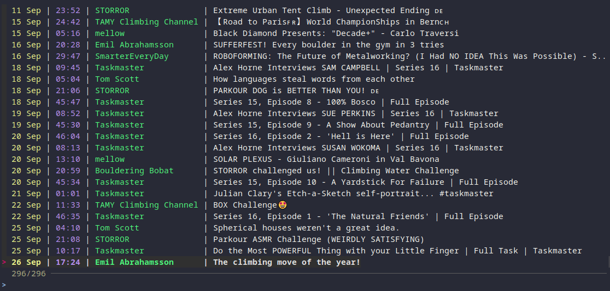

# yt-rss

Browse your YouTube subscriptions from the command-line, and play them using mpv.

This tool is highly opinionated, built primarily for my own use. It has limited external configurability; configuration changes are instead compiled into the program.

I built this tool in response to the enshittification of YouTube. Thumbnails are exaggerated, with half the frame taken up by someone making a goofy face. Titles filled with clickbait and hashtags. The UI being unable to show the full video title. The subscription feed filled with shorts.

uBlock Origin filters only go so far. I'm sick of dealing with all this nonsense. Hence, yt-rss.

This program uses RSS feeds to fetch videos from your subscriptions. It compactly displays the uploaded date, video duration, channel name, and video title. FZF is used for fast filtering. Selecting a video plays it in mpv.

